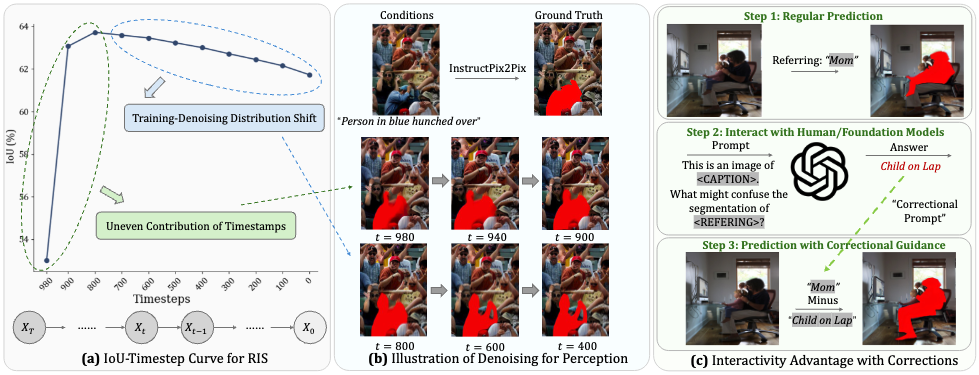
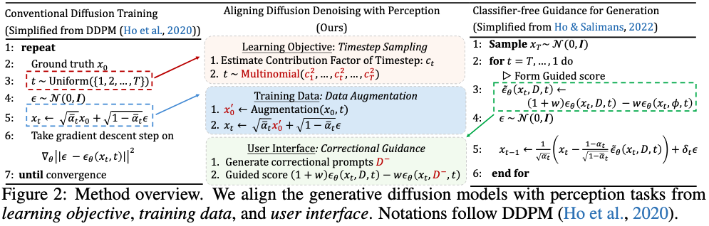

# [ICLR 2025] Aligning Generative Denoising with Discriminative Objectives Unleashes Diffusion for Visual Perception

[Ziqi Pang*](https://ziqipang.github.io/), [Xin Xu*](https://scholar.google.com/citations?user=McTjAwwAAAAJ&hl=en), [Yu-Xiong Wang](https://yxw.cs.illinois.edu/)

University of Illinois at Urbana Champaign

Paper Link: [Aligning Generative Denoising with Discriminative Objectives Unleashes Diffusion for Visual Perception]()

## Introduction

We envision generative models an important endeavor to develop unified vision models: all the tasks are modeled as pixel generation. In this paper, we analyze how to bridge the gaps between conventional diffusion models designed for generation and discriminative perception tasks. There are three main perspectives:

* **Uneven distribution of diffusion steps**: *How to reflect this in the training process?*
* **Training-denoising distribution shift**: *How to simulate such drifts for training?*
* **Interactivity**: *How to leverage classifier-free guidance and make diffusion models as agentic & interactive perception models?*

These issues are analyzed as the following figure, where we use "image editing" as a unified interface for referring image segmentation:



Our solutions are simple changes to the by-default strategies in diffusion models, which are shown to be effective in our experiments.



## Instructions

Code coming soon.

## Citations

If you find this work useful for your research, please consider citing:

```
@inproceedings{pang2025aligning,
  title={Aligning Generative Denoising with Discriminative Objectives Unleashes Diffusion for Visual Perception},
  author={Pang, Ziqi and Xu, Xin and Wang, Yu-Xiong},
  booktitle={International Conference on Learning Representations},
  year={2025}
}
```
